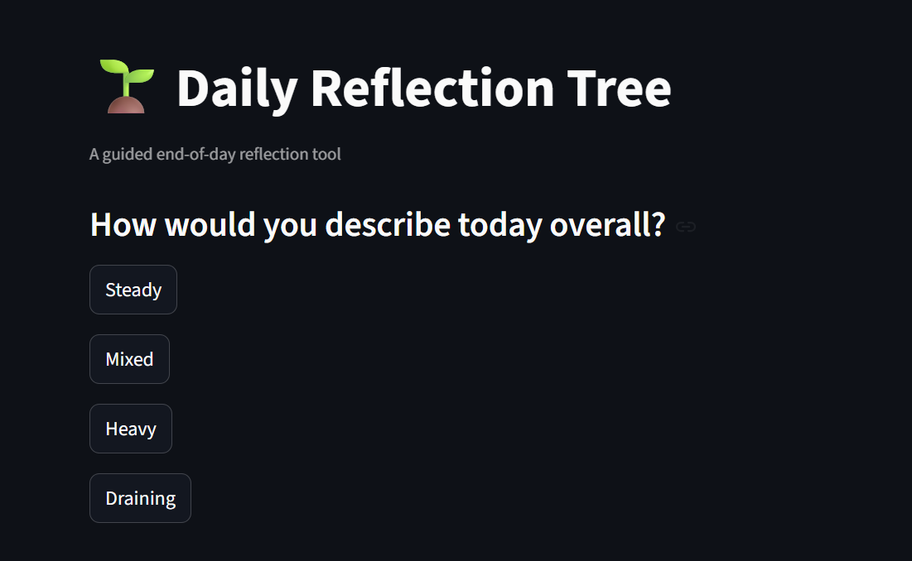

# Daily Reflection Tree

A deterministic end-of-day employee reflection tool built for the DeepThought CultureTech assignment.

## Overview

This project helps employees reflect on their day through a structured decision tree with fixed options and predictable branching logic.

The system explores three psychological dimensions:

1. **Agency / Locus of Control** – How the employee responded to events
2. **Contribution / Orientation** – What value they gave versus expected
3. **Perspective / Radius of Concern** – Whether focus stayed on self or widened to others

No LLM is used at runtime. The tool is fully deterministic.

---

## Features

* Structured reflection conversation
* Fixed multiple-choice questions
* Deterministic branching paths
* Personalized reflections based on choices
* End-of-session summary
* Streamlit web application
* JSON-driven tree logic

---

## Project Structure

```text id="k2n1yf"
DailyReflectionTree/
│── agent/
│   └── app.py
│── tree/
│   ├── reflection-tree.json
│   └── tree-diagram.png
│── transcripts/
│   ├── persona-1-transcript.md
│   └── persona-2-transcript.md
│── assets/
│   ├── app-home.png
│   └── app-summary.png
│── write-up.md
│── README.md
│── requirements.txt
```

---

## Flowchart

(Add your flowchart image here)


---

## App Preview

(Add screenshot here)



---

## How to Run Locally

```bash id="i4v0mn"
pip install -r requirements.txt
streamlit run agent/app.py
```

---

## Design Logic

The reflection tree uses real workplace moments such as:

* pressure
* recognition
* helping others
* setbacks
* responsibility
* perspective taking

All answers route to predefined next nodes.

Same answers = same experience.

---

## Why No Runtime AI

This avoids:

* hallucinations
* inconsistent responses
* unpredictable coaching

And ensures:

* trust
* auditability
* repeatability

---

## Included Deliverables

* Deterministic JSON decision tree
* Visual flowchart
* Working Streamlit prototype
* Two persona transcripts
* Design write-up

---

## Future Improvements

* scoring across dimensions
* trend analytics over time
* login system
* dashboard insights
* mobile optimization

---
